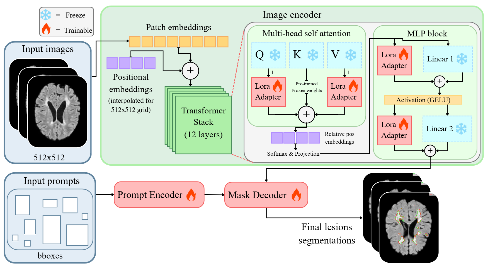

<div align="center">

# MSSegSAM
**A specialised adaptation of the Segment Anything Model (SAM) for Multiple Sclerosis (MS) lesion segmentation.**

[](https://github.com/WholeNow/MSSegSAM)
[](https://colab.research.google.com/github/WholeNow/MSSegSAM/blob/main/notebooks/train.ipynb)
[](https://colab.research.google.com/github/WholeNow/MSSegSAM/blob/main/notebooks/test.ipynb)

</div>

MSSegSAM is a specialised adaptation of the Segment Anything Model (SAM) for Multiple Sclerosis (MS) lesion segmentation. 

This project is built as a specific implementation of the [finestSAM](https://github.com/WholeNow/finestSAM) framework.

<div align="center">
  
  <p><i>The MSSegSAM integrates LoRA layers into the frozen SAM Image Encoder (ViT), specifically targeting the Query (Q), Value (V), and MLP blocks.</i></p>
</div>

## 📂 Dataset Creation

This project includes a specific script to convert original MRI images (NIfTI format) into the COCO format required for training.
For detailed instructions on how to use the dataset creation tool, please refer to the [Dataset Creation Documentation](prep_data/README.md).

## ⚙️ Setup

1. **Install Dependencies:**
   Install the required Python packages by running:
   ```bash
   pip install -r requirements.txt
    ```

2. **Download the Base Model Checkpoint:**
By default, this setup requires the Meta SAM (ViT-B) checkpoint. Ensure the `.pth` file is downloaded into the `finestSAM/sav/` directory. You can download it directly from Meta's repositories or run the interactive setup in the notebooks.

## 🚀 How to Run

The hyperparameters required for the model are specified in `finestSAM/config.py`. Ensure your dataset is correctly formatted in COCO structure before proceeding.

### Training

To train the model from scratch or fine-tune it further, run the `train` mode and specify the path to your prepared dataset:

```bash
python -m finestSAM --mode "train" --dataset "path/to/dataset"

```

> **Tip:** You can also run the training interactively using our [Google Colab Train Demo](https://colab.research.google.com/github/WholeNow/MSSegSAM/blob/main/notebooks/train.ipynb).

### Inference & Evaluation (Test)

To evaluate the model on your test dataset and generate predicted masks, use the `test` mode. You can specify the model type, load a specific trained checkpoint, and choose how many qualitative samples to save:

```bash
python -m finestSAM --mode "test" --dataset "path/to/test_dataset" --checkpoint "path/to/checkpoint_name.pth" --model_type "vit_b" --output_images "all"

```

> **Tip:** You can run inference easily using our [Google Colab Test Demo](https://colab.research.google.com/github/WholeNow/MSSegSAM/blob/main/notebooks/test.ipynb).

## 📄 License

The model is licensed under the [Apache 2.0 license](https://github.com/WholeNow/MSSegSAM/blob/main/LICENSE.txt).